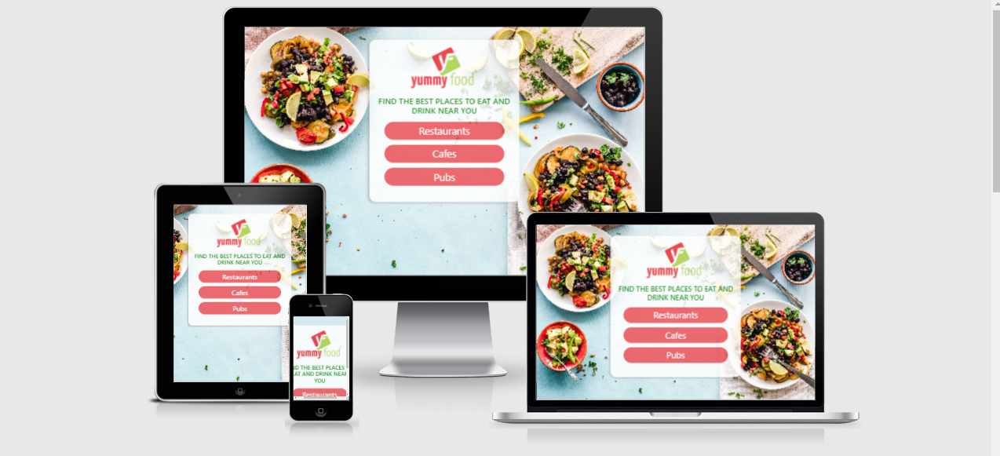

# Find The Best Place To Eat And Drink Near You.

View Live Project Here: [link](https://katiedoherty.github.io/MS2/)

## User Experience Design

### The Strategy Plane
This website was created to help the user find the top 20 places to eat and drink near their location. 

The aim of this website is to provide the user with a easy to use mobile web app that they can use anywhere in the world. Google Places returns the top rated places to the user within the implemented radius.

**Site Goals**

* To provide the user with suggestions of nearby restaurants, cafes and pubs.
* To provide the user with relevant information about a selected place.
* To provide the user with directions to their selected place.

**User Stories**

* As a user I want the purpose of the site to be clear so that I know what the site is about.
* As a user I want to easily navigate the site and find suggestions of nearby places easily.
* As a user, I want the website to be responsive so that I can clearly view the webpages from my mobile, tablet or desktop.
* As a user I want the web app to find my location automatically.
* As a user I want the app to give me suggestions of places to eat and drink within walking distance.
* As a user I want to easily zoom out when on the map and view all of the suggestions easily.
* As a user I want to see a photo of the selected place along with extra details about the place.
* As a user I want to know whether the business id operational or temporarily closed due to COVID-19.

### Scope Plane

**Features Planned**

* Responsive Design
* Homepage with 3 buttons for the three different options.
* Use Geolocation API to find the users location automatically when they click on a button on the homepage.
* Use Google Places to return nearby restaurants, cafes and pubs.
* A bottom Panel providing more information about the selected place.
* An infowindow providing a summary of information about the place.
* A directions button that the user can click and be given directions to selected place.

### The Structure Plane

User Story:

>  As a user I want the purpose of the site to be clear so that I know what the site is about.

Acceptance Criteria:

* Content should be clear and communicate what the site will do for the user.

Implementation:
Large font will be displayed on the homepage explaining what the site deos. Then the three buttons will provide the user with the three options on the site that they can serch for.

User Story:

>As a user I want to easily navigate the site and find suggestions of nearby places easily.

Acceptance Criteria:

* Navigation of the website should be easy for the user to follow.

Implementation:
The user can click any of the three buttons on the home page and the site will automatically find their location and return nearby places within walking distance. 
While on the map they can click on the markers to get the details of a selected place and then easily zoom out and see all the suggested places again by clicking anywhere on the map, on the "Tap To Zoom Oout" button or on the "x" of the infowindow. 
They can then navigate back to the homepage by simply clicking the back button and then click another button to find places in a different category.

User Story:

>As a user, I want the website to be responsive so that I can clearly view the webpages from my mobile, tablet or desktop.

Acceptance Criteria:

* The website will be well layed out on all devices so that the user can still navigate easily on smaller devices. 

Implementation:
Make the site a mobile first website as people will use this website more on their phones. The GPS on phones are also more accurate then laptops or PC's.
Utilize the Bootstrap framework to make the site responsive and continously check all screen sizes in the Chrome Developer Tools while developing the application.

User Story:

>As a user I want the web app to find my location automatically.

Acceptance Criteria:

* When the user navigates to the map the application will automatically find the users location for them.

Implementation:
Use Googles GeoLocation API to find users location. Enable the API on the Google Cloud Platform and add to your API key so that the application can access the users location.

User Story:

>As a user I want the app to give me suggestions of places to eat and drink within walking distance.

Acceptance Criteria:

* When the user location is identified the application will do a nearby search for the selected category with a 500 radius so that people are within short walking distance to a preferred destination.

Implementation:
I will utilise the Google Places API to identify nearby places in the users preferred category. 

User Story:

>As a user I want to easily zoom out when on the map and view all of the suggestions easily.

Acceptance Criteria:

* When the user clicks a market the application will zoom in to give the user more information about the selected place. Give the user easy ways to go back and view all the suggested nearby places to their location.

Implementation:
Set up a function that allows the user to click anywhere on the map and the application will zoom out to display all the nearby places again.
Install a button on the larger - medium sized screens that users can click to zoom out. Allow the user to zoom out on their mobile phone by clicking the "x" on the infowindow. 

User Story:

>As a user I want to see a photo of the selected place along with extra details about the place.

Acceptance Criteria:

* Provide the user with a pop up bottom panel filed with photos and information, once a marker has been clicked.

Implementation:
Use Google Places to return photos and other details in this panel. Only show the panel when a marker has been clicked and only show the information for that selected marker. 
When no marker is clicked on the panel should be hidden.

User Story:

>As a user I want to know whether the business id operational or temporarily closed due to COVID-19.

Acceptance Criteria:

* Provide the user with a message in the bottom pop up panel stating whether the business is operational or closed.

Implementation:
Add a function which targets the business status of the selected place and returns the result to the application. Turn this result into a friendly message notifying the user whether the business is still operational or not.

### The Skeleton Plane

**Wireframes**

*See Full Wireframes here:* [Wireframes](https://xd.adobe.com/view/db0df6de-3f99-41d7-abe2-c818cfa93c0f-8e5e/ "AdobeXD: Mockups")

### The Surface Plane

**Design**

**Colour Scheme**
I changed the color scheme to match the image I found on the internet as the image I used in the wireframes was not good quality when applied to a website.
* I used #d6e9ee (the colour in the background image)
* I used #ec484d (the colour for the buttons, it is the color in the logo.)
* I used Green for the large font on the homepage as it stands out to the user and communicates what the application deos.

**Typography**
* I just used the font that Google returned as I felt it worked the best and resembled Google's own application for finding nearby places.

### Differences To Design

* I was going to do a form and only return restaurants with filtered results. Unfortunately, you need to put in a PLace Details request to do so and Google Places API has only recently made this a server side request which means you need a proxy to retrieve results. I tried to use the heruko everywhere proxy url that so many other people use but they have recently put restrictions on this application and now it will only work as a temporary solution. The only other thing I could have done to get the Place details to return was to install a proxy locally, and I am not experienced enough to do that.
* I also put the panel with all the information on the bottom so that the extra information can be easily read on all devices as a side panel would block alot of the screen on smaller devices.
* I also added the Get Directions button directly onto the map rather than in the panel with the rest of the information.

## Features

* HomePage with three buttons for three different categorys.
* Users Location automatically found.
* Nearby Places automatically returned for that specific category.
* Zoom out features on the map to easily display all the nearby places to the user.
* A directions button to provide directions to the user.
* Infowindow when a marker is clicked with a summary of information about that place.
* A bottom panel with further details about the selected place.

## Features Left To Implement

* I want to provide the user with more information such as a website link, phone number and place description. For this I will need to install a proxy locally to make a Place Details request as Google has recently made this a client side application. The proxyurls return information too slowly and are only a temporary solution.

## Technologies used

* HTML
This project uses HTML as the main language used to complete the structure of the Website.

* CSS
This project uses custom written CSS to style the Website.

* JavaScript
Used to render map, nearby places and user location. It is also used to listen out for click events and to add some dynamic styling such as the bouncing marker, the bottom panel and the buttons.

* Font Awesome
All the Icons displayed throughout the website are Font Awesome icons.

* GitHub
GithHub is the hosting site used to store the source code for the Website.

* Git
Git is used as version control software to commit and push code to the GitHub repository where the source code is stored.

### Testing

Find the full user test report here:  [Test Report](writtenfile/test_results.xlsx "AdobeXD: Mockups")

